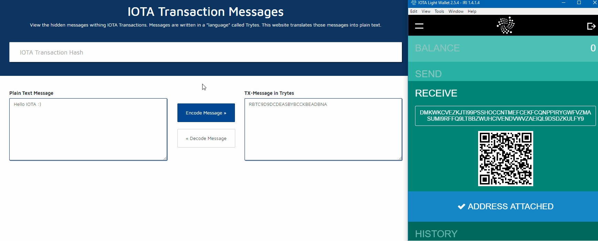

# IOTA Wallet Fork

Fork of normal IOTA Wallet with 2 additional features:
- Send transaction with a message attached
- Allows 0i transactions

### Demo with www.iota-messages.com


[www.iota-messages.com](http://www.iota-messages.com) helps you send transactions with messages. And view messages in existing transactions.

# IOTA App

## Prerequisites

1. Download [NodeJS](https://nodejs.org/en/download/)

2. Install [Electron](http://electron.atom.io):

  ```
  npm install -g electron
  ```

3. Install [Bower](https://bower.io/):

  ```
  npm install -g bower
  ```

#### Windows Users Only

  Run the following command as Administrator:

  ```
  npm install -g --production windows-build-tools
  ```

#### Compiling

If you wish to compile the app, install the following also: 

1. Install [Electron Builder](https://github.com/electron-userland/electron-builder)

 Electron Builder is used behind the scenes. Read their [instructions](https://github.com/electron-userland/electron-builder/wiki/Multi-Platform-Build) on how to set up your system.

2. Install [Docker](https://www.docker.com)

## Instructions

1. Clone this repository:

  ```
  git clone https://github.com/iotaledger/wallet
  ```

2. Go to the `wallet` directory:

  ```
  cd wallet
  ```

3. Clone iri: 

  ```
  git clone https://github.com/iotaledger/iri
  ```

  Note: make sure compiled iri.jar is in the `iri` folder.
  
4. Install components

  ```
  npm install
  ```

5. Run the app:

  ```
  npm start
  ```

6. If you wish to compile the app: 

  ```
  npm run compile
  ```

  If you'd like to create a package only for a specific OS, you can do so like this: 

  ```
  npm run compile:win
  npm run compile:mac
  npm run compile:lin
  ```

  Compiled binaries are found in the `out` directory.

#### Testnet

To build testnet binaries, rename `package.testnet.json` to `package.json` and follow instructions as above. Make sure the jar is named `iri-testnet.jar`.